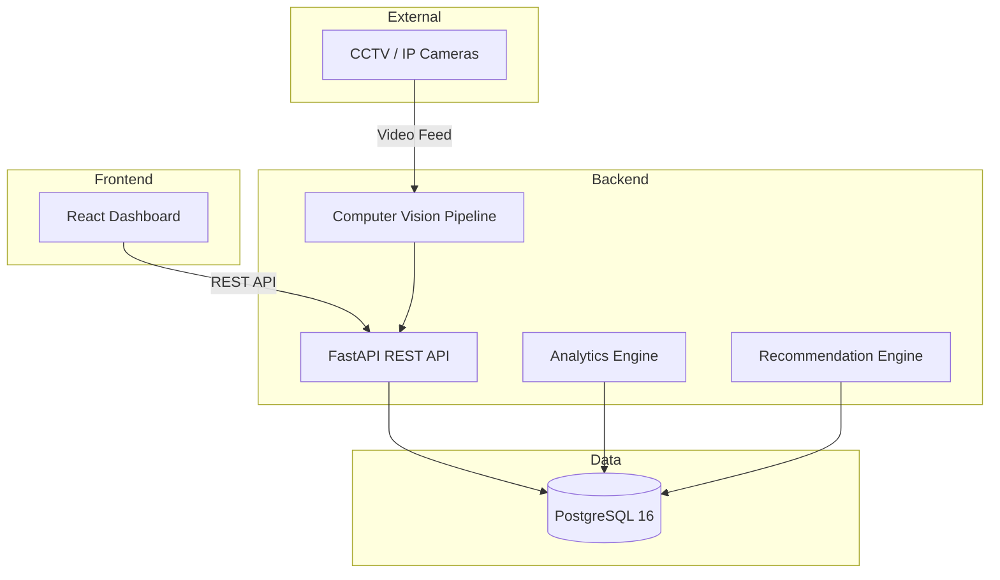

# 🏢 Workspace Monitor — AI-Powered Smart Workspace Occupancy Monitoring Platform


---

**Workspace Monitor** is an intelligent, real-time workspace occupancy monitoring platform that leverages **YOLO-based computer vision** to detect and track people across office zones. It provides live dashboards, historical analytics, heatmaps, and AI-driven recommendations to optimize space utilization — helping organizations reduce real-estate costs, improve employee experience, and make data-driven workplace decisions.

---

## ✨ Key Features

| # | Feature | Description |
|---|---------|-------------|
| 1 | **Real-Time Occupancy Detection** | YOLO v11-powered computer vision pipeline processes CCTV/IP camera feeds to count occupants per zone in real time. |
| 2 | **Interactive Dashboard** | Rich React dashboard with live counters, trend charts, and zone-level breakdowns updated via polling or WebSockets. |
| 3 | **Historical Analytics** | Query and visualize occupancy trends over hours, days, weeks, and months with flexible date-range filters. |
| 4 | **Heatmap Visualization** | Spatial heatmaps overlaid on floor plans show hotspots and underutilized areas at a glance. |
| 5 | **AI Recommendations** | Rule-based and ML-driven engine suggests optimal desk assignments, meeting room consolidation, and cleaning schedules. |
| 6 | **Multi-Zone Management** | Define, edit, and monitor unlimited zones (floors, rooms, open areas) with individual capacity thresholds and alerts. |
| 7 | **OAuth2 / JWT Authentication** | Secure login with Google/Microsoft OAuth2 or local credentials; role-based access control for admins, managers, and viewers. |
| 8 | **Alerting & Notifications** | Configurable alerts when zones exceed capacity thresholds — via in-app banners, email, or webhook integrations. |
| 9 | **RESTful API** | Fully documented FastAPI backend with auto-generated OpenAPI/Swagger docs, versioned endpoints, and consistent error handling. |
| 10 | **Dockerized Deployment** | One-command deployment with Docker Compose — separate production and development configurations included. |

---

## 🏗️ Architecture



---

## 🛠️ Tech Stack

| Layer | Technology | Purpose |
|-------|-----------|---------|
| **Frontend** | React 19, Vite 6, Recharts, React Router | SPA dashboard with charts and routing |
| **Styling** | CSS Modules / Vanilla CSS | Scoped, maintainable styling |
| **Backend** | FastAPI, Uvicorn, Pydantic v2 | Async REST API with validation |
| **ORM** | SQLAlchemy 2.0 (async) | Database models and queries |
| **Database** | PostgreSQL 16 | Relational data store |
| **Computer Vision** | Ultralytics YOLOv11, OpenCV | Person detection and counting |
| **Auth** | OAuth2, python-jose (JWT) | Secure authentication |
| **Containerization** | Docker, Docker Compose | Reproducible deployments |
| **Reverse Proxy** | Nginx | Static file serving, API proxy |
| **Testing** | Pytest, React Testing Library, Vitest | Unit and integration tests |

---

## 📋 Prerequisites

| Tool | Version | Check |
|------|---------|-------|
| **Docker** | 24+ | `docker --version` |
| **Docker Compose** | v2+ (built-in) | `docker compose version` |
| **Node.js** *(local dev)* | 22+ | `node --version` |
| **Python** *(local dev)* | 3.12+ | `python --version` |
| **Git** | 2.40+ | `git --version` |

---

## 🚀 Quick Start

### 1. Clone & Configure

```bash
git clone https://github.com/your-org/workspace-monitor.git
cd workspace-monitor
cp .env.example .env
# Edit .env with your secrets and configuration
```

### 2. Launch with Docker Compose

```bash
# Production
docker compose up -d --build

# Development (with hot-reload)
docker compose -f docker-compose.yml -f docker-compose.dev.yml up --build
```

### 3. Access the Application

| Service | URL |
|---------|-----|
| Frontend (prod) | [http://localhost](http://localhost) |
| Frontend (dev) | [http://localhost:5173](http://localhost:5173) |
| Backend API | [http://localhost:8000](http://localhost:8000) |
| API Docs (Swagger) | [http://localhost:8000/docs](http://localhost:8000/docs) |
| API Docs (ReDoc) | [http://localhost:8000/redoc](http://localhost:8000/redoc) |

---

## 💻 Local Development

### Backend

```bash
cd backend

# Create virtual environment
python -m venv .venv
source .venv/bin/activate   # Linux/macOS
.venv\Scripts\activate      # Windows

# Install dependencies
pip install -r requirements.txt

# Run with auto-reload
uvicorn app.main:app --reload --host 0.0.0.0 --port 8000
```

### Frontend

```bash
cd frontend

# Install dependencies
npm install

# Run dev server
npm run dev

# Build for production
npm run build
```

### Database

```bash
# Start only the database service
docker compose up db -d

# Connect with psql
docker compose exec db psql -U workspace_user -d workspace_monitor
```

---

## 📁 Project Structure

```text
workspace-monitor/
├── .env.example                 # Environment variable template
├── .gitignore                   # Git ignore rules
├── docker-compose.yml           # Production compose
├── docker-compose.dev.yml       # Development overrides
├── README.md                    # This file
│
├── backend/
│   ├── Dockerfile               # Multi-stage Python build
│   ├── requirements.txt         # Python dependencies
│   ├── alembic.ini              # Database migrations config
│   ├── alembic/                 # Migration scripts
│   └── app/
│       ├── main.py              # FastAPI application entry
│       ├── api/                 # Route handlers (v1/)
│       │   └── v1/
│       │       ├── zones.py
│       │       ├── occupancy.py
│       │       ├── analytics.py
│       │       └── auth.py
│       ├── core/                # Config, security, logging
│       │   ├── config.py
│       │   ├── security.py
│       │   └── logging.py
│       ├── models/              # SQLAlchemy ORM models
│       │   ├── zone.py
│       │   ├── occupancy.py
│       │   └── user.py
│       ├── schemas/             # Pydantic request/response
│       │   ├── zone.py
│       │   ├── occupancy.py
│       │   └── user.py
│       ├── services/            # Business logic
│       │   ├── zone_service.py
│       │   ├── occupancy_service.py
│       │   └── analytics_service.py
│       ├── cv/                  # Computer vision pipeline
│       │   ├── detector.py
│       │   └── processor.py
│       └── db/                  # Database session & utils
│           ├── session.py
│           └── base.py
│
├── frontend/
│   ├── Dockerfile               # Multi-stage Node build
│   ├── nginx.conf               # Nginx SPA + proxy config
│   ├── package.json             # Node dependencies
│   ├── vite.config.js           # Vite configuration
│   ├── index.html               # HTML entry point
│   └── src/
│       ├── main.jsx             # React entry
│       ├── App.jsx              # Root component
│       ├── components/          # Reusable UI components
│       │   ├── Dashboard/
│       │   ├── Heatmap/
│       │   └── Charts/
│       ├── pages/               # Route-level pages
│       │   ├── DashboardPage.jsx
│       │   ├── AnalyticsPage.jsx
│       │   └── ZonesPage.jsx
│       ├── hooks/               # Custom React hooks
│       │   ├── useOccupancy.js
│       │   └── useZones.js
│       ├── services/            # API client functions
│       │   └── api.js
│       └── styles/              # Global and module CSS
│           └── index.css
│
└── docs/
    └── architecture.md          # Detailed architecture doc
```

---

## 📅 Development Phases

| Phase | Focus | Status |
|-------|-------|--------|
| **Phase 1** | Architecture & Project Setup | ✅ Complete |
| **Phase 2** | Database Schema & Migrations | 🔲 Planned |
| **Phase 3** | Core Backend API (CRUD) | 🔲 Planned |
| **Phase 4** | Authentication & Authorization | 🔲 Planned |
| **Phase 5** | Computer Vision Integration | 🔲 Planned |
| **Phase 6** | Frontend Dashboard & Charts | 🔲 Planned |
| **Phase 7** | Analytics & Heatmaps | 🔲 Planned |
| **Phase 8** | Recommendations Engine | 🔲 Planned |
| **Phase 9** | Testing, CI/CD & Deployment | 🔲 Planned |

---

## 📖 API Documentation

Once the backend is running, interactive API documentation is available at:

- **Swagger UI** → [http://localhost:8000/docs](http://localhost:8000/docs)
- **ReDoc** → [http://localhost:8000/redoc](http://localhost:8000/redoc)

### Key Endpoints (Preview)

| Method | Endpoint | Description |
|--------|----------|-------------|
| `GET` | `/api/v1/zones` | List all zones |
| `POST` | `/api/v1/zones` | Create a new zone |
| `GET` | `/api/v1/zones/{id}` | Get zone details |
| `GET` | `/api/v1/occupancy/current` | Current occupancy snapshot |
| `GET` | `/api/v1/occupancy/history` | Historical occupancy data |
| `GET` | `/api/v1/analytics/summary` | Analytics summary |
| `GET` | `/api/v1/analytics/heatmap` | Heatmap data |
| `POST` | `/api/v1/auth/login` | User login |
| `GET` | `/api/v1/auth/me` | Current user profile |
| `GET` | `/health` | Health check |

---

## 🤝 Contributing

Contributions are welcome! Please follow these steps:

1. **Fork** the repository
2. **Create** a feature branch (`git checkout -b feature/amazing-feature`)
3. **Commit** your changes (`git commit -m 'feat: add amazing feature'`)
4. **Push** to the branch (`git push origin feature/amazing-feature`)
5. **Open** a Pull Request

### Guidelines

- Follow [Conventional Commits](https://www.conventionalcommits.org/) for commit messages
- Write tests for new features and bug fixes
- Update documentation when changing public APIs
- Ensure all CI checks pass before requesting review

---

## 📄 License

This project is licensed under the **MIT License** — see the [LICENSE](LICENSE) file for details.

---

<p align="center">
  Built with ❤️ for smarter workspaces
</p>
