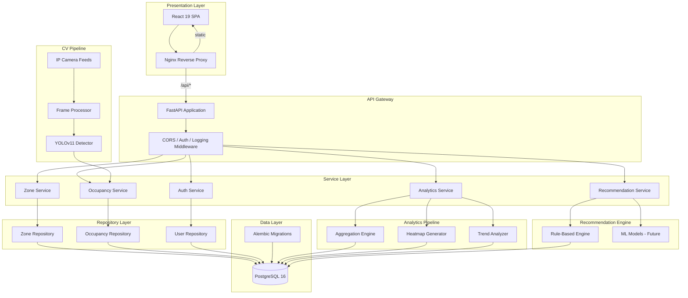
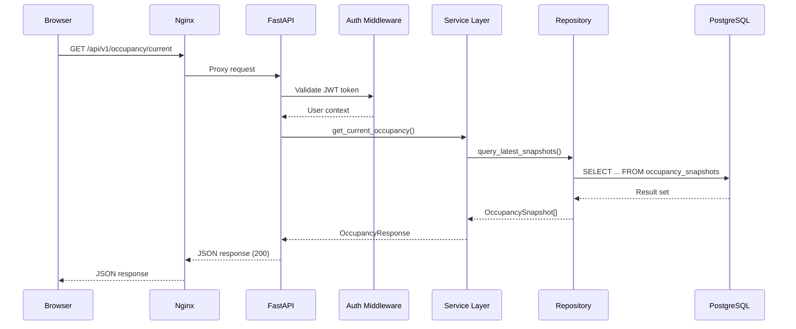
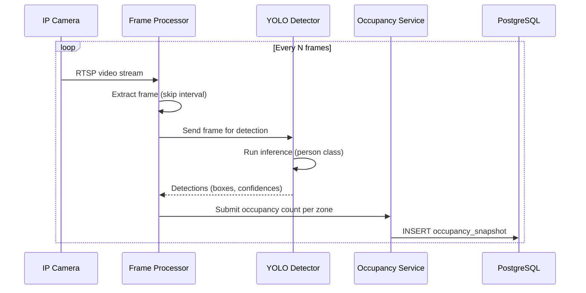
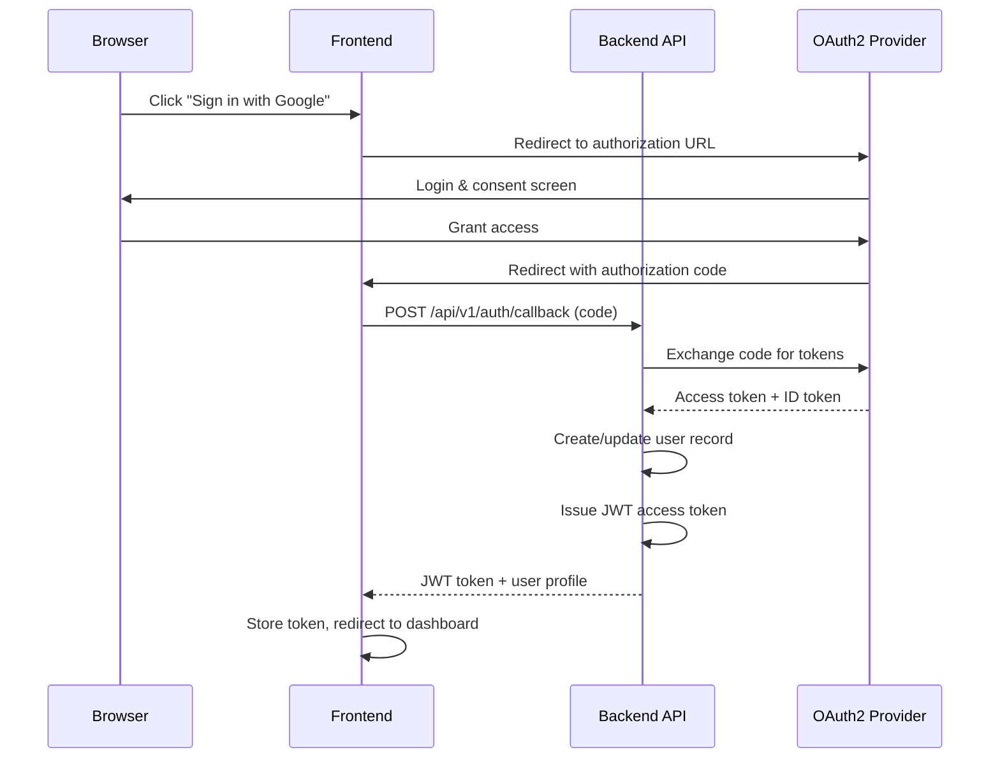
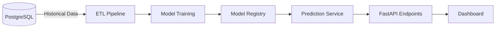

# 🏗️ Architecture — Workspace Monitor

> Detailed architecture documentation for the AI-Powered Smart Workspace Occupancy Monitoring Platform.

---

## Table of Contents

- [System Overview](#system-overview)
- [Component Architecture](#component-architecture)
- [Layer Descriptions](#layer-descriptions)
- [Data Flow](#data-flow)
- [Technology Decisions](#technology-decisions)
- [API Design Principles](#api-design-principles)
- [Security Architecture](#security-architecture)
- [Scalability Considerations](#scalability-considerations)
- [Future ML Pipeline](#future-ml-pipeline)

---

## System Overview

Workspace Monitor is a **three-tier, containerized application** that combines real-time computer vision with a modern web dashboard to monitor and optimize workspace utilization.

The system ingests video feeds from IP cameras, runs **YOLO-based person detection** to count occupants per zone, stores time-series occupancy data in PostgreSQL, and serves analytics through a React dashboard via a FastAPI REST API.

Key architectural goals:

- **Separation of concerns** — Clean Architecture with distinct layers for presentation, business logic, and data access
- **Async-first** — Non-blocking I/O throughout the backend for high concurrency
- **Container-native** — All services defined in Docker Compose for reproducible deployment
- **Extensible** — Plugin-ready design for new camera types, analytics modules, and notification channels

---

## Component Architecture



---

## Layer Descriptions

### Presentation Layer

| Component | Responsibility |
|-----------|---------------|
| **React 19 SPA** | Interactive dashboard with real-time occupancy counters, charts (Recharts), heatmap overlays, and zone management UI. Communicates exclusively via REST API calls. |
| **Nginx** | Serves static build assets, applies gzip compression and security headers, proxies `/api/*` requests to the FastAPI backend, and handles SPA fallback routing. |

### API Gateway

| Component | Responsibility |
|-----------|---------------|
| **FastAPI Application** | Defines versioned REST endpoints (`/api/v1/`), auto-generates OpenAPI documentation, and handles request routing. |
| **Middleware Stack** | CORS enforcement, JWT authentication validation, structured request/response logging, and global exception handling. |

### Service Layer

| Service | Responsibility |
|---------|---------------|
| **Zone Service** | CRUD operations for workspace zones (floors, rooms, open areas). Validates capacity thresholds and manages zone metadata. |
| **Occupancy Service** | Receives detection results from the CV pipeline, records timestamped occupancy snapshots, and provides current/historical counts. |
| **Analytics Service** | Aggregates occupancy data into hourly/daily/weekly/monthly summaries. Generates heatmap data and trend metrics. |
| **Recommendation Service** | Analyzes utilization patterns and generates suggestions for space optimization, desk assignment, and cleaning schedules. |
| **Auth Service** | Handles OAuth2 authorization code flow, issues/validates JWT access tokens, and manages user roles (admin, manager, viewer). |

### Repository Layer

| Repository | Responsibility |
|-----------|---------------|
| **Zone Repository** | SQLAlchemy queries for zone CRUD with async session management. |
| **Occupancy Repository** | Time-series optimized queries for occupancy records. Supports range queries and aggregation. |
| **User Repository** | User credential storage, role management, and OAuth2 account linking. |

### Data Layer

| Component | Responsibility |
|-----------|---------------|
| **PostgreSQL 16** | Primary relational data store. Stores zones, occupancy snapshots, users, and analytics aggregates. Uses indexes on timestamp columns for efficient time-range queries. |
| **Alembic** | Database migration management. Version-controlled schema changes with rollback support. |

### CV Pipeline

| Component | Responsibility |
|-----------|---------------|
| **Frame Processor** | Captures frames from IP camera RTSP streams at a configurable interval (`FRAME_SKIP_INTERVAL`). Handles connection management and reconnection. |
| **YOLOv11 Detector** | Runs person-class detection on each frame. Filters by configurable confidence threshold. Returns bounding boxes and counts per zone region. |

### Analytics Pipeline

| Component | Responsibility |
|-----------|---------------|
| **Aggregation Engine** | Periodically rolls up raw occupancy snapshots into hourly and daily summary tables for efficient dashboard queries. |
| **Heatmap Generator** | Maps detection coordinates to floor-plan grid cells, producing occupancy density matrices for visualization. |
| **Trend Analyzer** | Calculates moving averages, peak-hour identification, and week-over-week utilization comparisons. |

### Recommendation Engine

| Component | Responsibility |
|-----------|---------------|
| **Rule-Based Engine** | Applies configurable rules (e.g., "if zone utilization < 20% for 5 consecutive days, suggest consolidation"). |
| **ML Models (Future)** | Planned: train forecasting models on historical data to predict next-day occupancy and auto-suggest optimal configurations. |

---

## Data Flow

### Request Lifecycle



### CV Pipeline Flow



---

## Technology Decisions

| Component | Choice | Rationale |
|-----------|--------|-----------|
| **Backend Framework** | FastAPI | Async-native, auto-generated OpenAPI docs, Pydantic validation, excellent performance benchmarks. |
| **Frontend Framework** | React 19 | Component-based architecture, vast ecosystem, concurrent features for real-time updates. |
| **Build Tool** | Vite 6 | Sub-second HMR, native ESM, optimized production builds with Rollup. |
| **Database** | PostgreSQL 16 | ACID compliance, advanced indexing (BRIN for timestamps), JSON support, proven at scale. |
| **ORM** | SQLAlchemy 2.0 (async) | Mature, well-documented, async session support, Alembic migration integration. |
| **CV Model** | Ultralytics YOLOv11 | State-of-the-art accuracy/speed trade-off, easy fine-tuning, ONNX export for edge deployment. |
| **Auth** | OAuth2 + JWT | Industry standard, stateless token validation, supports Google/Microsoft identity providers. |
| **Containerization** | Docker Compose | Single-command deployment, service dependency management, volume persistence. |
| **Reverse Proxy** | Nginx | Battle-tested, efficient static file serving, simple proxy configuration. |
| **Charts** | Recharts | React-native, declarative API, responsive and composable chart components. |

---

## API Design Principles

### RESTful Convention

- Resources are nouns: `/api/v1/zones`, `/api/v1/occupancy`
- HTTP verbs for actions: `GET` (read), `POST` (create), `PUT` (full update), `PATCH` (partial update), `DELETE` (remove)
- Nested resources where logical: `/api/v1/zones/{zone_id}/occupancy`

### Versioning

- URL-based versioning: `/api/v1/`, `/api/v2/`
- Major version bumps only for breaking changes
- Deprecated endpoints return `Sunset` header with removal date

### Consistent Error Format

All errors follow a uniform JSON structure:

```json
{
  "detail": {
    "code": "ZONE_NOT_FOUND",
    "message": "Zone with ID 42 does not exist.",
    "timestamp": "2025-01-15T10:30:00Z",
    "path": "/api/v1/zones/42"
  }
}
```

### Pagination

List endpoints support cursor-based or offset pagination:

```
GET /api/v1/occupancy/history?offset=0&limit=50&sort=-timestamp
```

Response includes pagination metadata:

```json
{
  "data": [...],
  "pagination": {
    "total": 1250,
    "offset": 0,
    "limit": 50,
    "has_next": true
  }
}
```

---

## Security Architecture

### Authentication Flow



### Security Measures

| Measure | Implementation |
|---------|---------------|
| **JWT Tokens** | Short-lived access tokens (30 min default), signed with HS256. Refresh tokens planned for future phases. |
| **CORS** | Strict origin allowlist configured via `CORS_ORIGINS` environment variable. |
| **Input Validation** | Pydantic v2 models validate all request bodies and query parameters at the API boundary. |
| **SQL Injection** | Parameterized queries via SQLAlchemy ORM — no raw SQL string interpolation. |
| **Security Headers** | Nginx adds `X-Frame-Options`, `X-Content-Type-Options`, `X-XSS-Protection`, `Referrer-Policy`. |
| **Non-Root Container** | Backend runs as `appuser` — no root process in production containers. |
| **Secret Management** | Secrets loaded from environment variables, never committed to version control. `.env` is gitignored. |

---

## Scalability Considerations

### Current Design

| Strategy | Description |
|----------|-------------|
| **Connection Pooling** | SQLAlchemy async engine with configurable pool size and overflow limits. |
| **Async I/O** | FastAPI + Uvicorn handle thousands of concurrent connections with minimal threads. |
| **Frame Skipping** | `FRAME_SKIP_INTERVAL` reduces CV pipeline load by processing every Nth frame. |
| **Gzip Compression** | Nginx compresses API responses and static assets, reducing bandwidth by 60-80%. |
| **Static Asset Caching** | Immutable cache headers (`Cache-Control: public, immutable, max-age=31536000`) for hashed Vite bundles. |

### Future Scaling Path

| Scale Dimension | Strategy |
|----------------|----------|
| **Horizontal API Scaling** | Run multiple Uvicorn workers behind a load balancer (Nginx upstream or Kubernetes Ingress). |
| **Database Scaling** | Read replicas for dashboard queries, partitioned occupancy tables by month, BRIN indexes on timestamps. |
| **CV Pipeline Scaling** | Distribute camera feeds across worker nodes using a task queue (Celery + Redis or similar). |
| **Caching Layer** | Add Redis for frequently-accessed dashboard data (current occupancy, zone lists) with short TTLs. |
| **Edge Inference** | Export YOLO model to ONNX/TensorRT for on-premise GPU or edge device inference, reducing network bandwidth. |

---

## Future ML Pipeline

> **Status:** Planned for Phase 8+

### Occupancy Forecasting

- Train time-series models (LSTM / Prophet) on historical occupancy data
- Predict next-day and next-week occupancy per zone
- Serve predictions via `/api/v1/predictions/{zone_id}`

### Anomaly Detection

- Detect unusual occupancy patterns (e.g., weekend spikes, after-hours activity)
- Trigger alerts and audit logs for security review

### Optimization Engine

- Multi-objective optimization for desk assignment
- Minimize commute overlap, maximize team co-location
- Output daily/weekly seating recommendations

### Architecture for ML



---

<p align="center">
  <em>Last updated: July 2026</em>
</p>
