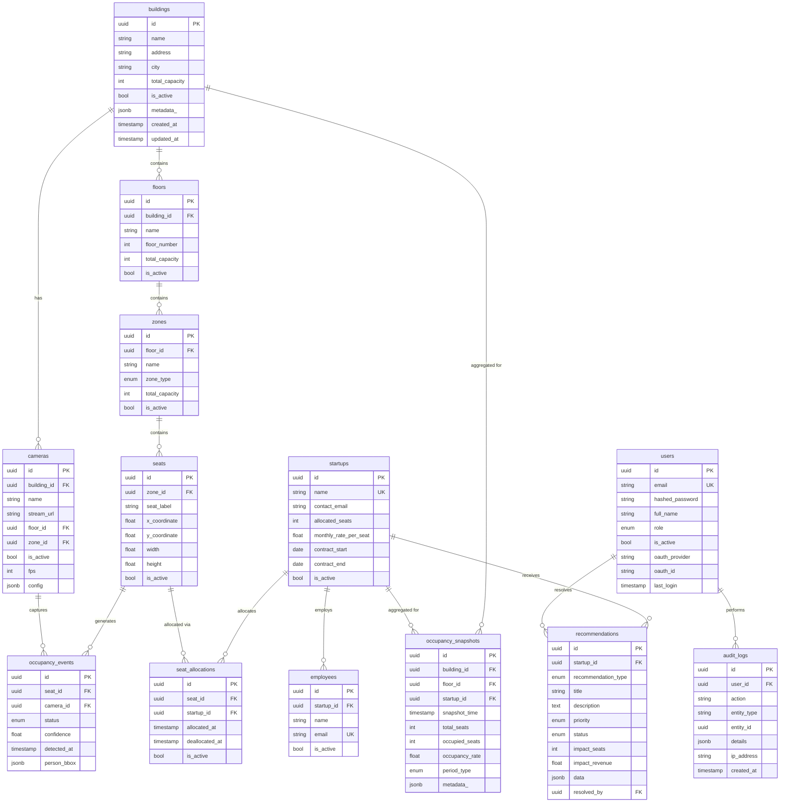

# Database Documentation

## Entity Relationship Diagram



---

## Table Descriptions

### 1. `users`

**Purpose**: System authentication users supporting both password-based and OAuth2 login.

| Column | Type | Nullable | Default | Description |
|--------|------|----------|---------|-------------|
| id | UUID | No | uuid4 | Primary key |
| email | VARCHAR(255) | No | — | Unique email address (login identifier) |
| hashed_password | VARCHAR(255) | Yes | — | Bcrypt hash (null for OAuth2-only users) |
| full_name | VARCHAR(255) | No | — | Display name |
| role | ENUM(ADMIN, MANAGER, VIEWER) | No | VIEWER | Authorization role |
| is_active | BOOLEAN | No | true | Soft delete flag |
| oauth_provider | VARCHAR(50) | Yes | — | e.g. 'google', 'github' |
| oauth_id | VARCHAR(255) | Yes | — | Provider's user ID |
| last_login | TIMESTAMP(tz) | Yes | — | Last successful login |
| created_at | TIMESTAMP(tz) | No | now() | Row creation time |
| updated_at | TIMESTAMP(tz) | No | now() | Last modification time |

**Indexes**: `ix_users_email` (unique), `ix_users_oauth` (oauth_provider, oauth_id)

---

### 2. `buildings`

**Purpose**: Top-level spatial entity representing physical coworking buildings.

| Column | Type | Nullable | Default | Description |
|--------|------|----------|---------|-------------|
| id | UUID | No | uuid4 | Primary key |
| name | VARCHAR(255) | No | — | Building name |
| address | VARCHAR(500) | Yes | — | Street address |
| city | VARCHAR(100) | Yes | — | City |
| total_capacity | INTEGER | No | 0 | Total seat capacity |
| is_active | BOOLEAN | No | true | Soft delete flag |
| metadata_ | JSONB | Yes | — | Flexible extra data |

**Relationships**: → floors (1:N), → cameras (1:N)

---

### 3. `floors`

**Purpose**: Floors within a building.

| Column | Type | Nullable | Default | Description |
|--------|------|----------|---------|-------------|
| id | UUID | No | uuid4 | Primary key |
| building_id | UUID (FK) | No | — | Parent building |
| name | VARCHAR(100) | No | — | e.g. 'Ground Floor' |
| floor_number | INTEGER | No | — | Numeric floor level |
| total_capacity | INTEGER | No | 0 | Floor seat count |
| is_active | BOOLEAN | No | true | Soft delete flag |

**Indexes**: `ix_floors_building_id`

---

### 4. `zones`

**Purpose**: Logical groupings of seats within a floor (open area, private, meeting room, etc.).

| Column | Type | Nullable | Default | Description |
|--------|------|----------|---------|-------------|
| id | UUID | No | uuid4 | Primary key |
| floor_id | UUID (FK) | No | — | Parent floor |
| name | VARCHAR(100) | No | — | e.g. 'Zone A' |
| zone_type | ENUM | No | OPEN | OPEN, PRIVATE, MEETING, COMMON |
| total_capacity | INTEGER | No | 0 | Zone seat count |
| is_active | BOOLEAN | No | true | Soft delete flag |

**Indexes**: `ix_zones_floor_id`

---

### 5. `seats`

**Purpose**: Individual seats with pixel coordinates for computer vision mapping.

| Column | Type | Nullable | Default | Description |
|--------|------|----------|---------|-------------|
| id | UUID | No | uuid4 | Primary key |
| zone_id | UUID (FK) | No | — | Parent zone |
| seat_label | VARCHAR(50) | No | — | e.g. 'A-01' |
| x_coordinate | FLOAT | Yes | — | Pixel X in camera frame |
| y_coordinate | FLOAT | Yes | — | Pixel Y in camera frame |
| width | FLOAT | Yes | — | Bounding box width |
| height | FLOAT | Yes | — | Bounding box height |
| is_active | BOOLEAN | No | true | Soft delete flag |

**Indexes**: `ix_seats_zone_id`, Unique(`zone_id`, `seat_label`)

---

### 6. `startups`

**Purpose**: Tenant companies with contract and billing details.

| Column | Type | Nullable | Default | Description |
|--------|------|----------|---------|-------------|
| id | UUID | No | uuid4 | Primary key |
| name | VARCHAR(255) | No | — | Company name (unique) |
| contact_email | VARCHAR(255) | Yes | — | Primary contact |
| contact_phone | VARCHAR(50) | Yes | — | Phone number |
| allocated_seats | INTEGER | No | 0 | Contracted seat count |
| monthly_rate_per_seat | FLOAT | No | 0.0 | $/seat/month |
| contract_start | DATE | Yes | — | Contract begin date |
| contract_end | DATE | Yes | — | Contract end date |
| is_active | BOOLEAN | No | true | Soft delete flag |

---

### 7. `seat_allocations`

**Purpose**: Maps seats to startups with allocation history tracking. A null `deallocated_at` means the allocation is currently active.

| Column | Type | Nullable | Default | Description |
|--------|------|----------|---------|-------------|
| id | UUID | No | uuid4 | Primary key |
| seat_id | UUID (FK) | No | — | Allocated seat |
| startup_id | UUID (FK) | No | — | Owning startup |
| allocated_at | TIMESTAMP(tz) | No | now() | When allocated |
| deallocated_at | TIMESTAMP(tz) | Yes | — | When deallocated (null = active) |
| is_active | BOOLEAN | No | true | Current allocation flag |

**Indexes**: `ix_seat_alloc_seat_active` (seat_id, is_active), `ix_seat_alloc_startup_active` (startup_id, is_active)

---

### 8. `occupancy_events` ⚡ (Hottest Table)

**Purpose**: Real-time CV detection events. Expected to accumulate **millions of rows**. Each row represents a single detection by the vision pipeline.

| Column | Type | Nullable | Default | Description |
|--------|------|----------|---------|-------------|
| id | UUID | No | uuid4 | Primary key |
| seat_id | UUID (FK) | No | — | Detected seat |
| camera_id | UUID (FK) | No | — | Source camera |
| status | ENUM | No | — | OCCUPIED, VACANT, UNKNOWN |
| confidence | FLOAT | Yes | — | Detection confidence (0-1) |
| detected_at | TIMESTAMP(tz) | No | — | Detection timestamp |
| person_bbox | JSONB | Yes | — | Bounding box `{x, y, w, h}` |

**Indexes**:
- `ix_occupancy_events_seat_detected` (seat_id, detected_at) — latest status per seat
- `ix_occupancy_events_camera_detected` (camera_id, detected_at) — camera feed queries
- `ix_occupancy_events_detected_at` (detected_at) — time-range aggregation

---

### 9. `occupancy_snapshots`

**Purpose**: Pre-computed aggregated occupancy metrics at regular intervals (5min, 15min, hourly, daily, weekly, monthly). Used for dashboards and analytics to avoid scanning the raw events table.

| Column | Type | Nullable | Default | Description |
|--------|------|----------|---------|-------------|
| id | UUID | No | uuid4 | Primary key |
| building_id | UUID (FK) | No | — | Building scope |
| floor_id | UUID (FK) | Yes | — | Floor scope (null = building-wide) |
| startup_id | UUID (FK) | Yes | — | Startup scope (null = all) |
| snapshot_time | TIMESTAMP(tz) | No | — | Snapshot timestamp |
| total_seats | INTEGER | No | — | Total seats in scope |
| occupied_seats | INTEGER | No | — | Occupied count |
| occupancy_rate | FLOAT | No | — | Percentage (0-100) |
| period_type | ENUM | No | — | MINUTE_5, MINUTE_15, HOURLY, DAILY, WEEKLY, MONTHLY |
| metadata_ | JSONB | Yes | — | Extra computed metrics |

**Indexes**: `ix_snapshot_building_time` (building_id, snapshot_time), `ix_snapshot_startup_time` (startup_id, snapshot_time)

---

### 10. `recommendations`

**Purpose**: AI-generated seat reallocation suggestions based on utilization analysis.

| Column | Type | Nullable | Default | Description |
|--------|------|----------|---------|-------------|
| id | UUID | No | uuid4 | Primary key |
| startup_id | UUID (FK) | Yes | — | Target startup |
| recommendation_type | ENUM | No | — | REALLOCATION, EXPANSION, REDUCTION, OPTIMIZATION |
| title | VARCHAR(255) | No | — | Short title |
| description | TEXT | No | — | Detailed description |
| priority | ENUM | No | MEDIUM | LOW, MEDIUM, HIGH, CRITICAL |
| status | ENUM | No | PENDING | PENDING, ACCEPTED, REJECTED, IMPLEMENTED |
| impact_seats | INTEGER | Yes | — | Seats affected |
| impact_revenue | FLOAT | Yes | — | Revenue impact ($) |
| data | JSONB | Yes | — | Detailed recommendation data |
| resolved_at | TIMESTAMP(tz) | Yes | — | When resolved |
| resolved_by | UUID (FK) | Yes | — | User who resolved |

---

### 11. `audit_logs`

**Purpose**: Immutable audit trail. No `updated_at` column — logs are append-only.

| Column | Type | Nullable | Default | Description |
|--------|------|----------|---------|-------------|
| id | UUID | No | uuid4 | Primary key |
| user_id | UUID (FK) | Yes | — | Acting user |
| action | VARCHAR(100) | No | — | e.g. 'SEAT_ALLOCATED' |
| entity_type | VARCHAR(100) | Yes | — | e.g. 'seat', 'startup' |
| entity_id | UUID | Yes | — | Affected entity's ID |
| details | JSONB | Yes | — | Context / before-after data |
| ip_address | VARCHAR(45) | Yes | — | Client IP |
| created_at | TIMESTAMP(tz) | No | now() | Event timestamp |

**Indexes**: `ix_audit_user_time` (user_id, created_at), `ix_audit_entity` (entity_type, entity_id), `ix_audit_created_at`

---

## Design Decisions

### UUIDs Instead of Auto-Increment IDs
- **Security**: Sequential IDs leak information (total row count, creation order) and are trivially enumerable
- **Distributed systems**: UUIDs can be generated client-side without DB round-trips, enabling future microservice decomposition
- **Merging**: No collision risk when merging data from multiple buildings/databases

### JSONB for Flexible Metadata
- `person_bbox` on occupancy_events stores variable bounding box data without schema changes
- `config` on cameras stores camera-specific settings (exposure, ROI, etc.) that vary by model
- `metadata_` on buildings and snapshots stores evolving business data without migrations
- PostgreSQL JSONB supports indexing with GIN indexes if needed later

### Separate occupancy_events vs occupancy_snapshots
- **Events** = raw, immutable, high-volume (millions of rows) — the source of truth from CV pipeline
- **Snapshots** = pre-computed, aggregated, lower-volume — what dashboards actually query
- This separation prevents expensive real-time aggregation on the hot events table
- Snapshots can be computed asynchronously by a background job

### Seat Allocation History (deallocated_at Pattern)
- A `null` deallocated_at means the allocation is currently active
- When seats are reallocated, the old row gets a `deallocated_at` timestamp and `is_active=false`
- This preserves full allocation history for audit, analytics, and trend analysis
- Enables queries like "which startup had this seat 3 months ago?"

### Indexing Strategy for occupancy_events
- **(seat_id, detected_at)**: The most critical index — used for "what's the latest status of seat X?"
- **(camera_id, detected_at)**: Used for camera-specific monitoring and debugging
- **(detected_at)**: Used for time-range aggregation queries (e.g., "occupancy between 9 AM and 5 PM")
- Future: Consider partitioning by `detected_at` (monthly/weekly) for archival and faster range scans

### Future ML Forecasting Support
- `occupancy_snapshots` with multiple `period_type` granularities provide ready-made training data
- `startups.contract_start/end` enables churn prediction
- `seat_allocations` history enables reallocation pattern learning
- JSONB `metadata_` fields can store feature vectors without schema migration

---

## Key Query Examples

### 1. Current Building Occupancy
```sql
-- Get the latest occupancy status for all active seats in a building
SELECT s.seat_label, z.name AS zone, oe.status, oe.confidence, oe.detected_at
FROM seats s
JOIN zones z ON s.zone_id = z.id
JOIN floors f ON z.floor_id = f.id
JOIN LATERAL (
    SELECT status, confidence, detected_at
    FROM occupancy_events
    WHERE seat_id = s.id
    ORDER BY detected_at DESC
    LIMIT 1
) oe ON true
WHERE f.building_id = :building_id AND s.is_active = true;
```

### 2. Startup Utilization Rates
```sql
-- Calculate utilization % for each startup
SELECT st.name,
       st.allocated_seats,
       COUNT(CASE WHEN oe.status = 'OCCUPIED' THEN 1 END) AS occupied_count,
       ROUND(COUNT(CASE WHEN oe.status = 'OCCUPIED' THEN 1 END)::numeric
             / NULLIF(st.allocated_seats, 0) * 100, 1) AS utilization_pct
FROM startups st
JOIN seat_allocations sa ON sa.startup_id = st.id AND sa.is_active = true
JOIN seats s ON sa.seat_id = s.id
LEFT JOIN LATERAL (
    SELECT status FROM occupancy_events
    WHERE seat_id = s.id ORDER BY detected_at DESC LIMIT 1
) oe ON true
WHERE st.is_active = true
GROUP BY st.id, st.name, st.allocated_seats;
```

### 3. Under-Utilized Startups (< 60% utilization)
```sql
SELECT name, allocated_seats, utilization_pct
FROM (
    -- subquery from query #2 above
) startup_util
WHERE utilization_pct < 60
ORDER BY utilization_pct ASC;
```

### 4. Occupancy Trend Over Time
```sql
-- Hourly occupancy trend for a building on a given date
SELECT snapshot_time, occupied_seats, total_seats, occupancy_rate
FROM occupancy_snapshots
WHERE building_id = :building_id
  AND period_type = 'HOURLY'
  AND snapshot_time BETWEEN :start_time AND :end_time
ORDER BY snapshot_time;
```

### 5. Revenue Leakage Calculation
```sql
-- Monthly revenue leakage = unused seats × rate
SELECT st.name,
       st.allocated_seats,
       ROUND(AVG(os.occupancy_rate), 1) AS avg_utilization,
       st.allocated_seats - ROUND(AVG(os.occupied_seats)) AS avg_unused_seats,
       (st.allocated_seats - ROUND(AVG(os.occupied_seats))) * st.monthly_rate_per_seat AS monthly_leakage
FROM startups st
JOIN occupancy_snapshots os ON os.startup_id = st.id AND os.period_type = 'DAILY'
WHERE os.snapshot_time >= DATE_TRUNC('month', CURRENT_DATE)
GROUP BY st.id, st.name, st.allocated_seats, st.monthly_rate_per_seat
ORDER BY monthly_leakage DESC;
```

### 6. Latest Seat Status
```sql
-- Get current status of a specific seat
SELECT oe.status, oe.confidence, oe.detected_at
FROM occupancy_events oe
WHERE oe.seat_id = :seat_id
ORDER BY oe.detected_at DESC
LIMIT 1;
```
